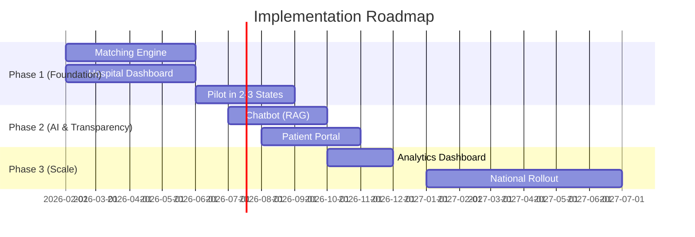

# Superpowers Brainstorm: Organ Donation & Recipient Matching Platform - India

## Goal
Build a **centralized, AI-powered organ donation and recipient matching platform** for India that:
- Connects all stakeholders (hospitals, NOTTO/ROTTO/SOTTO, transplant coordinators, donors, recipients)
- Automates the matching process using medical protocols (blood type, HLA, urgency, geography)
- Reduces organ allocation time from 4-6 hours to under 30 minutes
- Provides a RAG-powered chatbot for patient/family support
- Increases transplant numbers by 30-40% and reduces organ wastage from 20-25% to under 10%

---

## Constraints

| Category | Constraint |
|----------|------------|
| **Regulatory** | Must comply with THOA (Transplantation of Human Organs Act), DISHA guidelines, IT Act 2000 |
| **Medical** | 4-6 hour viability window for most organs; state-wise allocation priority per Indian regulations |
| **Infrastructure** | Variable internet connectivity across India; must work in low-bandwidth scenarios |
| **Integration** | Must integrate with existing NOTTO/ROTTO/SOTTO systems, not replace them |
| **Security** | HIPAA-equivalent compliance; Aadhaar-based authentication; end-to-end encryption |
| **Multi-language** | Support for Hindi, Tamil, Telugu, Bengali, Marathi, and English minimum |
| **Scalability** | Cloud-native (GCP) architecture to scale from pilot (2-3 states) to all-India |
| **Medical Accuracy** | Chatbot responses must be medically verified; clear "not medical advice" disclaimers |

---

## Known Context

### Current State
- **500,000+ patients** waiting annually; only **15,000-20,000 transplants** performed
- Kidney: 150,000-200,000 need, only 7,000-8,000 receive
- Liver: 30,000 waiting, only 1,500-2,000 transplanted
- **20-25% organ wastage** due to coordination failures
- Fragmented systems across states with manual processes

### Existing Systems
- **NOTTO** (National), **ROTTO** (Regional), **SOTTO** (State) - official government bodies
- Some states have digital registries (Tamil Nadu, Maharashtra, Karnataka are most advanced)
- No unified national real-time matching system exists

### Key Stakeholders
1. Transplant hospitals and coordinators
2. NOTTO/ROTTO/SOTTO officials
3. Donor families (critical decision-makers)
4. Recipients and their families
5. Surgical and retrieval teams
6. Logistics providers (ambulance, air transport)

### Technical Considerations
- GCP as cloud platform (Vertex AI, Cloud Run, Firestore/Spanner)
- RAG system needs vector database + LLM (Gemini/PaLM 2)
- Real-time notifications via SMS, email, push
- Responsive web design for field coordinators

---

## Risks

| Risk | Severity | Mitigation |
|------|----------|------------|
| **Regulatory resistance** | HIGH | Partner with NOTTO from day one; position as enhancement not replacement |
| **Hospital adoption friction** | HIGH | Integrate with existing workflows; provide training; demonstrate time savings |
| **Data privacy breaches** | CRITICAL | Zero-trust architecture; encryption; VAPT testing; compliance audits |
| **Medical errors from AI** | CRITICAL | Human-in-the-loop for all matches; AI assists, humans decide |
| **Network connectivity issues** | MEDIUM | Offline-first PWA; SMS fallbacks; queue-based sync |
| **Chatbot misinformation** | HIGH | RAG with verified knowledge base only; human escalation path |
| **Interstate coordination politics** | MEDIUM | Clear allocation policies; transparent logging; regulatory backing |
| **Organ transport logistics** | HIGH | Partner with established medical transport networks; GPS tracking |
| **System downtime during critical match** | CRITICAL | Multi-region deployment; 99.99% SLA target; manual fallback procedures |

---

## Selected Approach: Full Web Platform

**Description**: Build the complete web-based platform with 5 major components

| Component | Features |
|-----------|----------|
| Matching Engine | Real-time donor-recipient matching with scoring algorithm |
| Hospital Dashboard | Waitlist management, logistics coordination, notifications |
| Chatbot | RAG-powered AI assistant for all stakeholder queries |
| Transparency Portal | Patient waitlist view, status tracking |
| Admin Panel | NOTTO/ROTTO dashboard, analytics, reporting |

**Pros**: Complete solution; maximum impact; single integrated system; web-based for universal access
**Cons**: Higher initial investment; longer development time (12-18 months)
**Effort**: 12-18 months | Team of 12-15 engineers

---

## Implementation Roadmap

### Pilot State Recommendation
- **Tamil Nadu**: Most mature transplant program; tech-savvy coordinators
- **Maharashtra**: High volume; Mumbai's hospital network
- **Karnataka**: Strong SOTTO; Bangalore's tech talent for support

---

## Acceptance Criteria

### Phase 1 MVP (Must-Have for Launch)

| # | Criterion | Verification |
|---|-----------|--------------|
| 1 | Match score calculated within 5 seconds of donor registration | Performance test with 10,000 recipient records |
| 2 | Allocation time reduced by 50% vs. current manual process | A/B comparison with pilot hospitals |
| 3 | SMS/Email notifications delivered within 30 seconds of match | End-to-end notification test |
| 4 | 15-minute escalation if primary coordinator doesn't respond | Automated test of escalation workflow |
| 5 | 100% audit trail for all allocation decisions | Compliance review by NOTTO representative |
| 6 | System handles 50 concurrent users per hospital | Load testing with k6 or similar |
| 7 | 99.9% uptime during pilot | Monitoring with GCP Cloud Monitoring |
| 8 | Zero PHI exposure in logs or error messages | Security audit |
| 9 | Works on 3G network (field coordinator scenario) | Mobile testing on throttled connection |
| 10 | Training completed for 50+ coordinators across pilot states | Training attendance + competency test |

### Future Phases

| Phase | Key Acceptance Criteria |
|-------|------------------------|
| Phase 2 (Chatbot) | 80% of queries answered without human escalation; <5s response time |
| Phase 2 (Portal) | Patients can view waitlist position; receive status notifications |
| Phase 3 (Analytics) | State-wise dashboards; organ wastage tracking; predictive insights |

---

*Generated by Superpowers Brainstorm Workflow*
